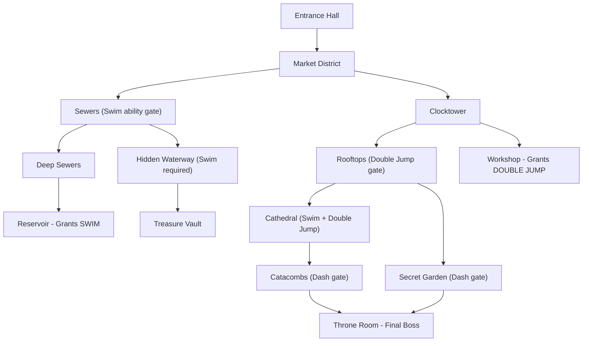

# Progression Map Examples

Reference library of progression structures with annotated examples.
Use these patterns as starting points when designing zone flow, gating, and unlock dependencies.

---

## Progression Archetypes

### 1. Linear Progression

The simplest structure. The player moves through content in a fixed order.

```
[Start] --> [A] --> [B] --> [C] --> [D] --> [End]
```

**Characteristics:**
- Guaranteed ordering of content
- Every player sees the same sequence
- Easy to pace and balance
- Low replayability
- No player agency in route choice

**Best for:** Tutorials, story-critical sequences, corridor shooters, narrative-driven chapters.

**Example: The Awakening (Tutorial Zone)**

```
[Prison Cell] --> [Guard Encounter] --> [Armory (Weapon Tutorial)]
     --> [Courtyard (Combat Tutorial)] --> [Gate Puzzle]
     --> [Escape Chase] --> [Forest Exit]
```

| Node | Type | Duration | Teaches | Unlocks |
|------|------|----------|---------|---------|
| Prison Cell | Exploration | 3 min | Movement, interaction | Guard Encounter |
| Guard Encounter | Combat | 3 min | Basic attack, dodge | Armory |
| Armory | Exploration | 5 min | Equipment, inventory | Courtyard |
| Courtyard | Combat | 5 min | Combo attacks, blocking | Gate Puzzle |
| Gate Puzzle | Puzzle | 5 min | Environmental interaction | Escape Chase |
| Escape Chase | Chase | 4 min | Sprint, hazard avoidance | Forest Exit |
| Forest Exit | Cutscene | 2 min | N/A | Open world access |

**Total playtime:** 27 minutes
**Gating:** Strictly sequential. Each node requires the previous one to be completed.

---

### 2. Branching Progression

The player chooses between paths that may reconverge or lead to different outcomes.

```
                /--> [B1] --> [B2] --\
[Start] --> [A]                       --> [D] --> [End]
                \--> [C1] --> [C2] --/
```

**Characteristics:**
- Player agency in route selection
- Content can be tailored to different playstyles
- Convergence point ensures all players reach the same destination
- Requires balancing multiple paths to equivalent difficulty and duration
- Increases total content budget (some content is seen by only some players)

**Best for:** Story branches, faction choices, playstyle-specific routes (stealth vs combat).

**Example: The Crossroads**

```
                    /--> [Mountain Pass] --> [Eagle's Nest] --\
[Village Hub] --> [Choice Point]                               --> [Valley Temple]
                    \--> [River Path] --> [Waterfall Cave] ---/
```

| Path | Style | Duration | Difficulty | Unique Reward |
|------|-------|----------|------------|--------------|
| Mountain Pass | Combat-heavy, vertical | 35 min | Hard (elevation hazards) | Eagle Feather Cloak |
| River Path | Stealth/exploration | 40 min | Medium (patrol avoidance) | River Stone Amulet |

**Gating:** Player must choose one path. The other becomes inaccessible until a later revisit
mechanic unlocks it. Both paths grant a key required for Valley Temple.

---

### 3. Hub-and-Spoke

A central hub connects to multiple independent zones. The player returns to the hub between excursions.

```
            [Zone A]
              |
[Zone D] -- [HUB] -- [Zone B]
              |
            [Zone C]
```

**Characteristics:**
- Player chooses order of zone completion
- Hub provides services (shop, save, crafting)
- Zones can be designed independently with minimal cross-dependencies
- Natural pacing through hub returns (rest/resupply between zones)
- Completion requirements can gate later content (e.g., "complete 3 of 4 zones to unlock finale")

**Best for:** Mid-game content, dungeon selection screens, town-based RPGs, mission-select structures.

**Example: The Shattered Isles**

```
                [Fire Island]
                    |
[Storm Island] -- [Harbor Town (HUB)] -- [Frost Island]
                    |
                [Shadow Island]
```

| Zone | Theme | Level Range | Duration | Required? | Unlock Condition |
|------|-------|-------------|----------|-----------|-----------------|
| Harbor Town | Safe hub | All | Persistent | N/A | Starting location |
| Fire Island | Volcanic combat | 10-15 | 45 min | Yes (1 of 3) | Speak to Captain |
| Frost Island | Puzzle/exploration | 12-17 | 50 min | Yes (1 of 3) | Speak to Captain |
| Storm Island | Survival/environmental | 14-19 | 40 min | Yes (1 of 3) | Speak to Captain |
| Shadow Island | Boss gauntlet | 18-22 | 60 min | Yes (finale) | Complete 3 islands |

**Gating:** Player must complete any 3 of the 4 islands to unlock Shadow Island.
This provides flexibility while ensuring adequate player level for the finale.

**Hub Services Per Return:**
- Shop inventory updates after each island completion
- New NPCs appear with side quests
- Crafting recipes unlock based on island materials
- Story exposition advances through NPC dialogue

---

### 4. Open World

Large interconnected space with minimal hard gating. Progression is driven by player
curiosity and soft gating (difficulty, equipment requirements).

```
[A] --- [B] --- [C]
 |       |       |
[D] --- [E] --- [F]
 |       |       |
[G] --- [H] --- [I]
```

**Characteristics:**
- Maximum player freedom
- Soft gating through level-appropriate difficulty
- Requires robust world design to prevent sequence breaking
- Content must be enjoyable in any order
- Hardest to balance and pace
- Highest replayability

**Best for:** Open world RPGs, sandbox games, exploration-focused designs.

**Example: The Verdant Expanse**

```
[Frozen North] --- [Mountain Range] --- [Sky Temple]
      |                   |                  |
[Dark Forest]  --- [Central Plains] --- [Desert East]
      |                   |                  |
[Swamp South]  --- [Coastal Town]  --- [Volcanic Isle]
```

| Region | Soft Gate (Level) | Content Type | Points of Interest |
|--------|------------------|-------------|-------------------|
| Central Plains | 1-10 | Starting area, tutorials | 8 camps, 3 villages, 12 encounters |
| Coastal Town | 5-15 | Hub, commerce, quests | Port, market, guild hall |
| Dark Forest | 8-18 | Exploration, stealth | 6 dungeons, hidden village, world boss |
| Swamp South | 12-22 | Survival, crafting | Alchemy lab, 4 challenge arenas |
| Desert East | 15-25 | Combat gauntlet | Colosseum, treasure vaults |
| Mountain Range | 18-28 | Platforming, puzzles | Dwarven ruins, mine network |
| Frozen North | 22-32 | Endurance, resource management | Ice fortress, survival challenges |
| Sky Temple | 25-35 | Boss rush | 5 boss encounters, final dungeon |
| Volcanic Isle | 28-38 | Endgame content | Raid encounters, legendary gear |

**Soft Gating Mechanics:**
- Enemy levels scale within a range (not fully to player level)
- Equipment requirements naturally guide progression
- Story breadcrumbs lead toward level-appropriate zones
- Fast travel unlocks only after discovering a region on foot

---

### 5. Metroidvania Gating

Areas are interconnected but gated by abilities or items. Backtracking with new capabilities
opens previously inaccessible paths.

```
[Start] --> [A] --> [B] -----> [C]
             |       |          |
             v       v          v
           [A-2]   [B-2]     [C-2]
          (needs   (needs    (needs
          Dash)    Grapple)  Both)
```

**Characteristics:**
- World is physically interconnected from the start
- Hard gates require specific abilities or items
- Backtracking is a core mechanic, not a failure state
- Discovery of new paths in old areas creates "aha" moments
- Requires careful ability-gate mapping to avoid soft-locks
- Map design must telegraph gated paths (player should see the path they cannot yet reach)

**Best for:** Exploration-driven games, ability-progression systems, interconnected world designs.

**Example: The Undercity**



**Ability-Gate Map:**

| Ability | Acquired In | Gates Opened |
|---------|------------|-------------|
| Double Jump | Workshop (Clocktower) | Rooftops, Upper Market shortcuts |
| Swim | Reservoir (Deep Sewers) | Sewers, Hidden Waterway, Cathedral access |
| Dash | Cathedral reward | Catacombs, Secret Garden, various shortcuts |

**Progression Order (Critical Path):**
1. Entrance Hall -> Market District (free access)
2. Market -> Clocktower -> Workshop (acquire Double Jump)
3. Clocktower -> Rooftops (use Double Jump)
4. Market -> Sewers -> Deep Sewers -> Reservoir (acquire Swim)
5. Rooftops + Swim -> Cathedral (use both abilities)
6. Cathedral -> acquire Dash -> Catacombs
7. Catacombs -> Throne Room (final boss)

**Optional Content:**
- Hidden Waterway -> Treasure Vault (requires Swim, rewards legendary loot)
- Secret Garden (requires Dash, rewards unique cosmetic + lore)
- Upper Market shortcuts (requires Double Jump, reduces backtrack time)

---

## Unlock Dependency Patterns

### Key-and-Lock

The most straightforward gating pattern. Player finds an item or completes a task to unlock
a specific barrier.

```
[Find Key A] ----unlocks----> [Door A]
[Find Key B] ----unlocks----> [Door B]
[Door A + Door B] --unlocks-> [Final Area]
```

**Design rules:**
- The key and its lock should be in the same zone or adjacent zones
- The player should see the lock before finding the key (creates anticipation)
- Keys should be memorable items, not generic collectibles

### Ability Gate

Progression gated by player capabilities rather than items.

```
[Learn Ability] ----enables----> [Reach New Area]
[Upgrade Ability] --enables----> [Reach Hidden Area]
```

**Design rules:**
- Gated paths must be visually recognizable (e.g., "I can see that ledge but cannot reach it yet")
- The ability must be taught in a safe context before it is required for progression
- Multiple gates using the same ability should feel distinct

### Reputation/Faction Gate

Access determined by standing with game factions.

```
[Complete Faction Quests] ----reputation----> [Faction Zone Access]
```

**Design rules:**
- Reputation requirements should be achievable through multiple quest types
- Gate should not force grinding (enough organic reputation from zone play)
- Opposing factions should offer alternative content, not just blocked content

### Composite Gate

Multiple conditions must be met simultaneously.

```
[Ability A] + [Item B] + [Quest C complete] ----unlocks----> [Secret Area]
```

**Design rules:**
- Maximum 3 requirements for any single gate
- All requirements should be achievable in the current act or progression tier
- Clearly communicate all requirements (quest log, NPC hints, environmental clues)

---

## Zone Progression Checklist

- [ ] Critical path is clearly defined and tested end-to-end
- [ ] No dead ends without a return path or fast travel
- [ ] All gates have their keys/abilities available before the gate is encountered on the critical path
- [ ] Optional content is discoverable but not required for main progression
- [ ] Backtracking (if required) introduces new content in previously visited areas
- [ ] Level recommendations or soft gates prevent the player from entering overwhelming content
- [ ] Zone completion unlocks a clear reward (new area, story beat, or significant loot)
- [ ] Progression map has been reviewed for soft-lock potential at every gate
- [ ] Players can identify their next objective from any point in the zone
- [ ] Fast travel or shortcuts reduce tedious traversal in late-zone or post-completion play
