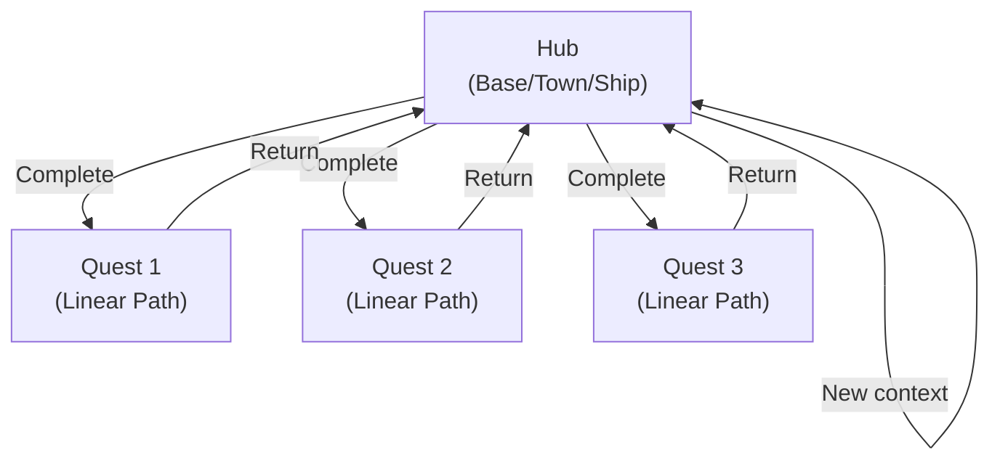
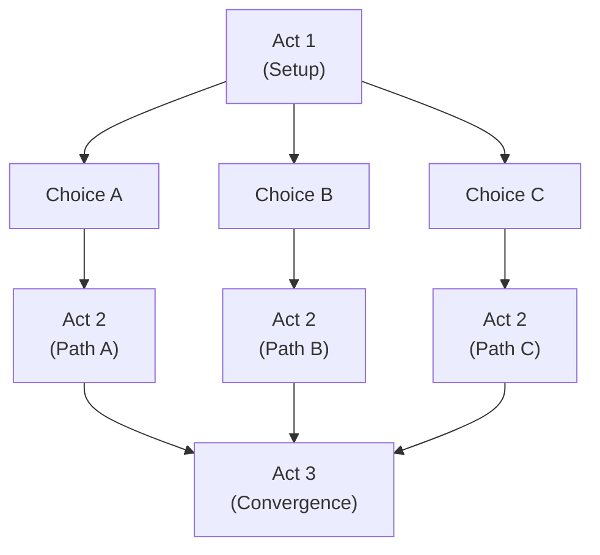
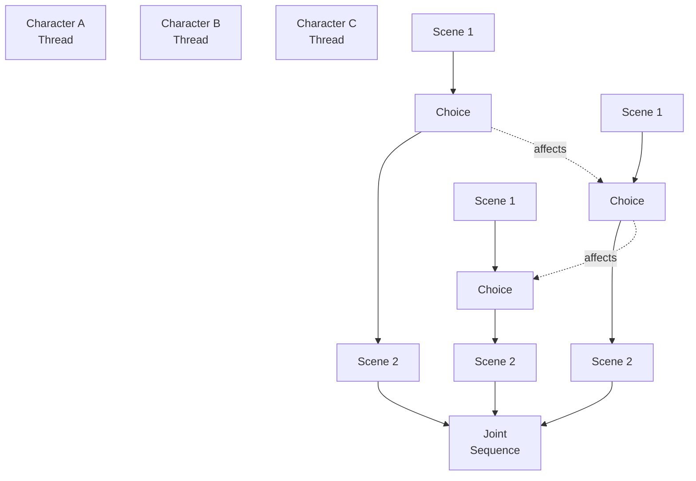
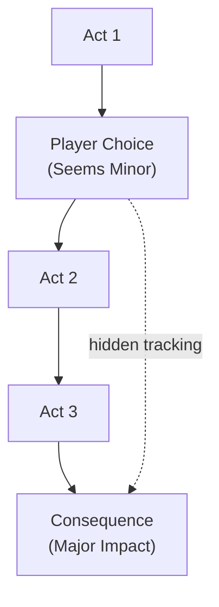
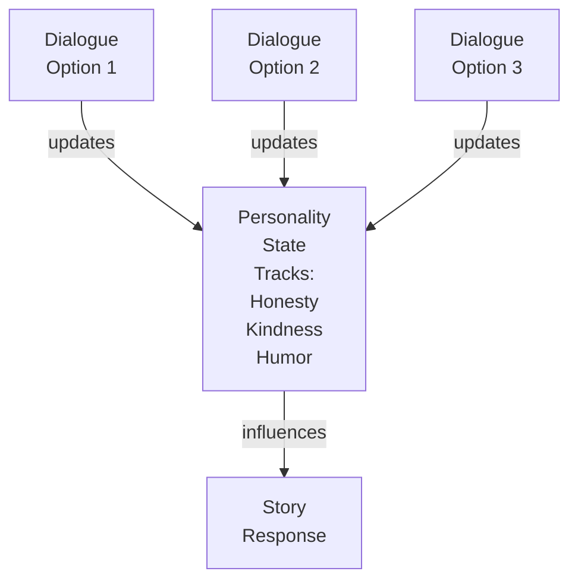
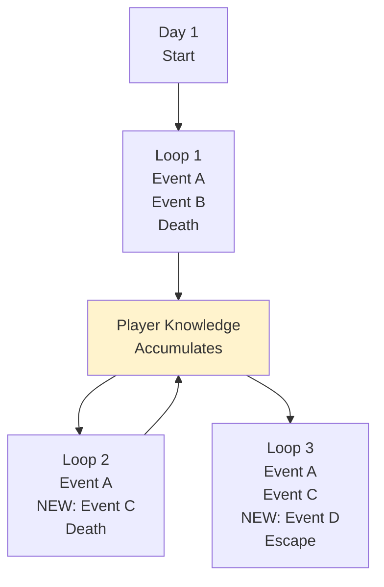
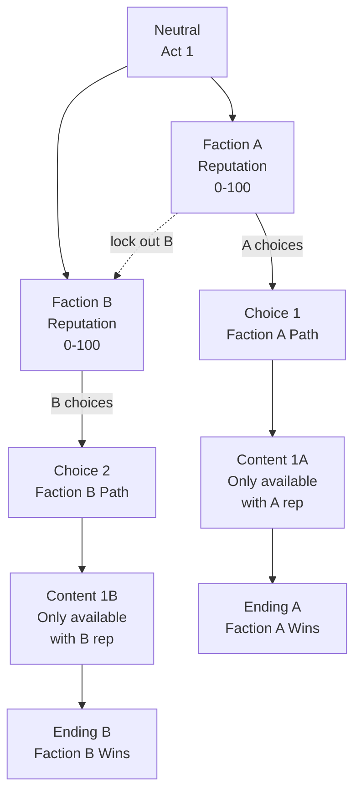
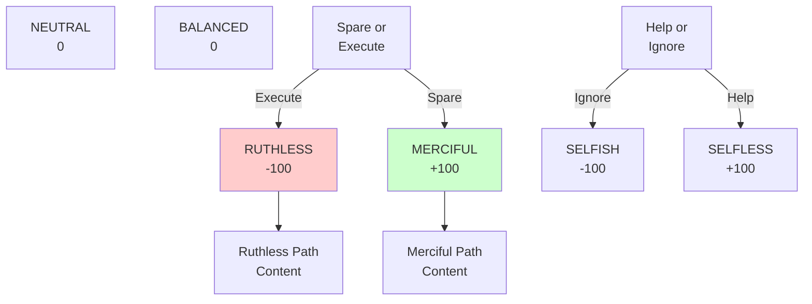

# Narrative Branching Patterns

A catalog of proven branching narrative structures. Each pattern enables different types of player agency and story outcomes.

---

## 1. Hub and Spoke

**Description**: Central location/character serves as hub. Player departs for linear story segments, returns with new information, segments interconnect. Choices in spokes affect hub reception and available paths.

**When to Use**:
- Episodic games (return to hub between episodes)
- Multiple character perspectives (crew, party members)
- Modular story segments (quests, cases, adventures)

**Structure Diagram**:

**Pros**:
- Modular design (easy to create/test segments)
- Clear progression (hub as checkpoint)
- Replayable segments
- Character growth visible when returning to hub
- Scales well (add more spokes)

**Cons**:
- Spokes can feel disconnected from each other
- Hub can feel cramped with returning content
- Repetitive returns to hub
- Limited character interaction between segments
- Less emergent storytelling

**Implementation Complexity**: Low-Medium
- Build hub as safe/static space
- Create linear story for each spoke
- Track choices in spokes with flags
- Implement return mechanics (quest complete triggers return)
- Use dialogue changes based on completed spokes

**Example**: Mass Effect (Citadel as hub, missions as spokes, crew conversations reflect missions)

---

## 2. Waterfall

**Description**: Linear sequence of story beats. Each major choice gates the next segment. Player path is locked-in once chosen, no backtracking.

**When to Use**:
- Single character arc (focused protagonist)
- Linear narrative experience
- Time-critical story (no reset mechanics)
- Games with permanent consequences

**Structure Diagram**:

**Pros**:
- Clear, understandable structure
- Consequences feel permanent and meaningful
- Focused narrative (no parallel paths to maintain)
- Encourages replaying to see other branches
- Easy to write (linear at each stage)

**Cons**:
- Limited simultaneous player choices
- Paths might converge, eliminating differences
- Less replayability within single playthrough
- Can feel on-rails
- Doesn't encourage experimentation

**Implementation Complexity**: Low
- Create branching scenes with clear choice points
- Lock previous choices (fade them out or remove)
- Use flags to track which path player took
- Implement path-specific content/dialogue
- Converge paths at major story beats

**Example**: Life is Strange (linear progression between episodes, major choices per episode)

---

## 3. Parallel Paths

**Description**: Multiple character-specific story threads run simultaneously. Player switches between characters/perspectives. Choices in one thread affect another.

**When to Use**:
- Multi-character narratives (party, ensemble cast)
- Stories with multiple viewpoints
- Heist-style simultaneous missions
- Games where coordination matters

**Structure Diagram**:

**Pros**:
- Rich ensemble storytelling
- Cross-cutting choices (Thread A affects Thread B)
- Replay value (experience different perspectives)
- Character relationships develop through parallel paths
- Allows different playstyles per character

**Cons**:
- Complex to write and track
- Hard to balance story emphasis (each character important)
- Synchronization issues (when do paths reconverge?)
- Player attachment imbalance (some characters more interesting)
- Testing burden (all path combinations must work)

**Implementation Complexity**: High
- Implement character selection/switching
- Create flags for each character thread
- Track cross-thread influences (when A does X, B sees consequence)
- Balance story time per character
- Create convergence/divergence scenes
- Test all valid path combinations

**Example**: Fire Emblem (multiple character perspectives, choices affect other units), Disco Elysium (skill voices as parallel narratives)

---

## 4. Delayed Consequence

**Description**: Player action has delayed impact. Consequences appear multiple chapters later, seemingly unrelated to original choice. Creates tension and rewards careful play.

**When to Use**:
- Mystery/detective games (investigation affects ending)
- Long-form narratives (20+ hour games)
- Games emphasizing caution (not rushing)
- Rewarding player attentiveness

**Structure Diagram**:

**Pros**:
- Rewards careful play and attention
- Creates emergent stories (player discovers connections)
- Felt impact (players remember choice, see outcome)
- Encourages multiple playthroughs
- Realistic consequence timing

**Cons**:
- Hard to signal importance (players might miss consequence)
- Risk of player forgetting original choice
- Complex to implement (flag tracking over long periods)
- Some consequences might feel cheap/disconnected
- Debugging nightmare (which choice caused this?)

**Implementation Complexity**: Medium-High
- Create detailed choice tracking system
- Store metadata about choices (who, when, context)
- Create consequence triggers based on accumulated choices
- Implement flashback/reminder scenes before consequences
- Document all choice-consequence links clearly
- Test for unintended interactions between choices

**Example**: Disco Elysium (dialogue choices affect available options chapters later), Hades (story details based on conversation choices)

---

## 5. Invisible Reactivity

**Description**: Player isn't aware of choices being made. Dialogue/actions are tracked passively. Story reacts to accumulated behaviors without explicit branching.

**When to Use**:
- Conversational games (where you can't always "not choose")
- Games about character development (personality emerges)
- Subtle storytelling (reactions vs. plot changes)
- Games where choice is implicit

**Structure Diagram**:

**Pros**:
- Feels natural (not forced choice moments)
- Player agency through consistent behavior
- Avoids "choose your backstory" awkwardness
- Personality emerges over time
- Hard to optimize (no "right" answer)

**Cons**:
- Player might not realize choices matter
- Consequence attribution is fuzzy
- Hard to implement correctly (requires robust state system)
- Feedback isn't immediate (player doesn't know what changed)
- Can feel random if poorly implemented

**Implementation Complexity**: Medium
- Implement personality tracking system
- Create behavior accumulation (traits score over time)
- Implement dialogue/story responses based on trait levels
- Add feedback systems (subtle character comments on personality)
- Document trait-response mappings
- Test that personality changes feel earned

**Example**: Undertale (pacifist/genocide determined by kills, story reacts), Disco Elysium (personality stats based on dialogue choices)

---

## 6. Time Loop

**Description**: Story repeats, but player retains knowledge. Each loop adds information or changes outcomes. Story progresses toward revelation or escape.

**When to Use**:
- Mystery games (accumulate evidence across loops)
- Roguelikes with narrative (progression despite resets)
- Games about prediction/adaptation
- Stories where repetition is thematic

**Structure Diagram**:

**Pros**:
- Thematic (repetition mirrors story)
- Rewards observation (careful watchers discover shortcuts)
- Natural progression (loops get shorter as player optimizes)
- Tension building (approaching endpoint)
- Solves the "how does knowledge persist" problem narratively

**Cons**:
- Requires carefully balanced pacing (loops can't be boring)
- Easy to become tedious (repeating same content)
- Must account for player speedrunning loop
- Hard to surprise without feeling cheap
- Implementation overhead (reset mechanics)

**Implementation Complexity**: High
- Implement full game reset mechanism
- Create knowledge persistence system
- Track which events player has witnessed
- Implement event variations (changes based on knowledge)
- Create loop escape conditions
- Build emotional pacing (loops gradually revealing)
- Test for tedium (loops must stay engaging)

**Example**: The Stanley Parable (multiple playthroughs reveal story), Outer Wilds (time loop with knowledge persistence), Hades (story reveals across runs)

---

## 7. Faction Paths

**Description**: Player alignment with factions determines available content, dialogue, and endings. Faction choices are often implicit (through missions, dialogue tone) and accumulate until point of no return.

**When to Use**:
- Games with ideological conflicts
- Morally gray situations
- Games where you can't please everyone
- Political/war narratives

**Structure Diagram**:

**Pros**:
- Clear player identity (your faction)
- Ideological depth (pick what you believe)
- Replayability (try other factions)
- Content gating feels natural (faction doesn't trust you yet)
- Easy to implement (reputation flags)

**Cons**:
- Point of no return can feel unfair if unclear
- Subtle transitions might miss moment where player locks in
- Difficult to balance (one faction always seems better)
- Can feel restrictive (closing content)
- Hard to write neutral early content

**Implementation Complexity**: Medium
- Create faction reputation tracking (separate counter per faction)
- Implement content gating based on reputation
- Create dialogue variations based on reputation
- Define point of no return (high rep = locked in)
- Implement exclusive content per faction
- Create faction-specific endings
- Balance rep gain/loss across choices

**Example**: Fallout (NCR vs. Legion), Elder Scrolls (Civil War factions), Baldur's Gate 3 (companion romances gate faction content)

---

## 8. Moral Spectrum

**Description**: Player choices place them on spectrum(s) of morality/philosophy. Spectrum affects available actions, dialogue, and character perception. Different than factions (spectrums are flexible, not binary).

**When to Use**:
- Character-driven stories
- Games about moral complexity
- RPGs with defined moral framework
- Stories where player philosophy matters

**Structure Diagram**:

**Pros**:
- Nuanced morality (not binary good/evil)
- Player identity emerges (your values shown)
- Replayability (multiple spectrum positions feel different)
- Natural consequences (world reacts to your values)
- Easy to expand (add new spectrums)

**Cons**:
- Risk of feeling preachy (if creator's morality shows)
- Hard to implement consistently
- Can lead to "right" and "wrong" answers
- Feedback might not feel immediate
- Multiple spectrums get overwhelming

**Implementation Complexity**: Medium
- Define 2-4 morality spectrums
- Track player position on each spectrum
- Create dialogue variations per spectrum position
- Implement content gating (certain content requires certain alignment)
- Create spectrum-specific endings
- Balance so no alignment is clearly superior
- Add feedback (character comments on values)

**Example**: Telltale's The Walking Dead (tough moral choices), Baldur's Gate 3 (approach-based choices affecting character), Mass Effect (Paragon/Renegade spectrum)

---

## Pattern Comparison Matrix

| Pattern | Replayability | Complexity | Writing Load | Implementation | Best For |
|---------|---------------|-----------|-------------|----------------|----------|
| Hub & Spoke | High | Low | Medium | Low | Episodic games |
| Waterfall | High | Low | Low | Low | Linear narratives |
| Parallel Paths | High | High | High | High | Ensemble stories |
| Delayed Consequence | High | High | High | High | Mysteries, detective |
| Invisible Reactivity | Medium | Medium | Medium | Medium | Character-driven |
| Time Loop | Medium | High | Medium | High | Roguelikes, puzzle |
| Faction Paths | High | Medium | Medium | Medium | Political games |
| Moral Spectrum | High | Medium | Medium | Medium | RPGs, character arcs |

---

## Implementation Tips

**Choice Tracking**:
- Store choices with metadata (who, when, why)
- Create unique IDs for all choice points
- Document choice dependencies (this choice requires that choice)
- Build choice search/filter tools for debugging

**Testing Branching**:
- Create choice matrix (every valid path combination)
- Test paths in order: most common, edge cases, broken paths
- Use debug tools to jump to choice points
- Playtest with explicit instruction to test branching
- Watch for narrative contradictions between branches

**Pacing Across Branches**:
- Keep branch lengths within 10% of each other (don't make one path 3x longer)
- Converge and diverge evenly (don't bottleneck to one path)
- Vary pacing per branch, but keep total time similar
- Avoid making every branch feel consequential (some should be flavor)

**Writing Multiple Paths**:
- Create character voice guide (consistency across paths)
- Document story continuity (what does ending expect to be true?)
- Use modular scenes (reusable neutral content)
- Create branch "best practices" documentation
- Define what's mutable (story) vs. fixed (character personality)
