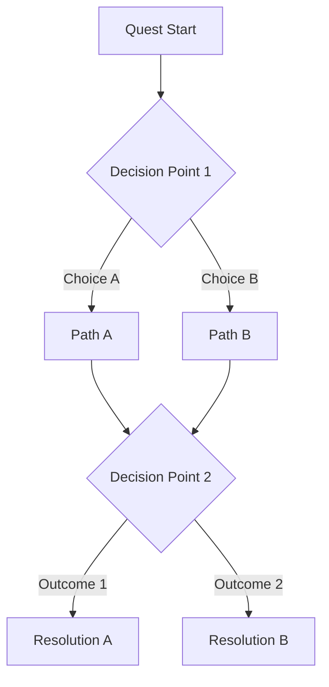

# Quest Design Template

A comprehensive template for designing quests. Every quest should be documented using this structure before entering production. The template ensures that narrative intent, gameplay requirements, branching logic, and integration points are all captured upfront.

---

## Template Fields

### Header Block

```markdown
# Quest: [Quest Name]

**Quest ID:** [unique_snake_case_id]
**Type:** [Main | Side | Faction | Crew | Ambient | Radiant]
**Act:** [1 | 2 | 3 | Interlude | Post-game]
**Region:** [Star system or station where the quest primarily takes place]
**Estimated Duration:** [Playtime in minutes for a typical player]
**Writer:** [Author name]
**Status:** [Concept | Draft | Review | Final]
**Theme:** [Which narrative theme this quest explores -- see narrative-bible.md]
```

### Quest Type Definitions

| Type | Description | Scope |
|------|-------------|-------|
| **Main** | Critical path quests that advance the central mystery | Required for completion |
| **Side** | Self-contained stories in the world, not required for main progression | Optional, substantial |
| **Faction** | Quests tied to faction reputation and faction-specific storylines | Optional, gated by faction standing |
| **Crew** | Personal quests for crew members aboard the player's ship | Optional, relationship-gated |
| **Ambient** | Small environmental encounters discovered through exploration | Optional, no quest log entry |
| **Radiant** | Procedurally parameterized quests using templates (patrol, scan, deliver) | Repeatable, low-narrative |

---

### Hook

How the player discovers this quest. Hooks must feel organic within the world.

```markdown
## Hook

**Discovery Method:** [NPC dialogue | Distress signal | Environmental clue | Item found | Codex entry | Automatic (story progression)]
**Hook Location:** [Where the player encounters the hook]
**Hook Description:**
[1-3 sentences describing the moment the player becomes aware of this quest. What draws them in? What question does the hook raise that makes the player want to answer it?]

**Fallback Hook:** [If the player misses the primary hook, how else might they encounter this quest?]
```

---

### Summary

```markdown
## Summary

[One paragraph: what happens in this quest and why it matters to the story. This is the "elevator pitch" for the quest. A designer reading only this paragraph should understand the quest's purpose.]
```

---

### Prerequisites

```markdown
## Prerequisites

- **Level/Progression:** [Minimum player level or progression milestone, if any]
- **Required Quests:** [Quest IDs that must be completed before this quest is available]
- **Required Flags:** [Game state flags that must be set]
- **Required Items:** [Items the player must possess]
- **Required Relationships:** [NPC relationship thresholds]
- **Required Faction Standing:** [Faction reputation thresholds]
- **Region Access:** [Does the player need to have unlocked this region?]
```

---

### Objectives

```markdown
## Objectives

### Primary Objectives
1. [The main thing the player must do to complete the quest]
2. [Second required step, if any]

### Secondary Objectives (Optional)
1. [Optional objective that provides bonus reward or deeper narrative]
2. [Another optional objective]

### Hidden Objectives
1. [Discoverable through exploration, dialogue, or environmental attention]
2. [Not shown in quest log until discovered or completed]

### Failure Conditions
- [What causes the quest to fail, if applicable]
- [Time limits, NPC deaths, wrong choices that lock out completion]
```

---

### Narrative Arc

```markdown
## Narrative Arc

### Setup
[What the player learns at the start. What is the situation? Who is involved? What does the player think this quest is about?]

### Complication
[The twist, the escalation, or the dilemma. The thing that makes this quest more than a fetch-and-return. What challenges the player's assumptions?]

### Climax
[The peak moment -- the hardest fight, the biggest decision, the revelation. What is the most memorable moment of this quest?]

### Resolution
[How the quest concludes. Describe the default resolution and all major variants based on player choices.]

### Aftermath
[What changes in the world after this quest? NPC states, region changes, unlocked content, seeds for future quests.]
```

---

### Key Characters

```markdown
## Key Characters

| Character | Role in Quest | Motivation | Starting State | Ending State |
|-----------|--------------|------------|----------------|--------------|
| [NPC Name] | [Quest giver / Ally / Antagonist / Victim / Witness] | [What they want] | [How the player finds them] | [How they end up based on outcomes] |
```

---

### Choices and Consequences

```markdown
## Choices & Consequences

### Decision Point: [Name of the choice]
**Context:** [Situation when the choice arises]
**Location in quest:** [After which objective]

| Choice | Immediate Result | Short-term Consequence | Long-term Consequence |
|--------|-----------------|----------------------|----------------------|
| [Option A] | [What happens right now] | [What changes in the next few hours of play] | [What echoes in later quests or the ending] |
| [Option B] | [What happens right now] | [What changes in the next few hours of play] | [What echoes in later quests or the ending] |
| [Option C] | [What happens right now] | [What changes in the next few hours of play] | [What echoes in later quests or the ending] |

**Flags Set:**
- Option A: `[flag_name]`
- Option B: `[flag_name]`
- Option C: `[flag_name]`
```

---

### Branching Paths

```markdown
## Branching Structure

**Pattern:** [Hub and Spoke | Waterfall | Parallel Paths | Delayed Consequence | etc. -- see branching-patterns.md]

[Mermaid diagram of the quest's branching structure]


```

---

### Rewards

```markdown
## Rewards

### Completion Rewards (All Paths)
- **XP:** [amount] *(flag for economy-designer review)*
- **Currency:** [amount and type] *(flag for economy-designer review)*
- **Narrative Reward:** [What story payoff does the player get? A revelation, a relationship deepened, a mystery answered?]

### Path-Specific Rewards
| Path | Item Reward | Unique Unlock | Narrative Outcome |
|------|------------|---------------|-------------------|
| [Path A] | [Item name and stats] | [Codex entry, location access, NPC availability] | [Story consequence] |
| [Path B] | [Item name and stats] | [Codex entry, location access, NPC availability] | [Story consequence] |

### Secondary Objective Rewards
- [Bonus XP, rare item, or lore unlock for completing optional objectives]

### Hidden Objective Rewards
- [Special item, unique codex entry, or relationship bonus for discovery]
```

---

### Dialogue Scenes

```markdown
## Dialogue Scenes

| Scene | File Reference | Participants | Context |
|-------|---------------|-------------|---------|
| [Scene name] | `dialogue_[id].json` | [NPC names] | [When this scene triggers] |
```

---

### Failure States

```markdown
## Failure States

| Failure Condition | Trigger | Consequence | Recovery Possible? |
|------------------|---------|-------------|-------------------|
| [What can go wrong] | [Specific game state] | [What happens to the player and the world] | [Yes/No -- if yes, how] |
```

---

### Design Notes

```markdown
## Design Notes

**Purpose:** [Why does this quest exist? What theme does it explore? What mechanic does it teach or reinforce? What emotional beat does it hit in the larger arc?]

**Pacing Context:** [Where does this quest fall in the player's journey? What quests likely come before and after? Is this a breather after intensity, or an escalation?]

**Inspiration:** [Real-world references, other games, films, books that inspired this quest's design]

**Known Risks:** [What might not work? Where are the weak points? What needs playtesting?]

**Integration Notes:**
- **To level-designer:** [Environmental requirements, encounter design needs]
- **To economy-designer:** [Reward balance concerns, resource placement]
- **To systems-designer:** [New mechanics needed, skill checks, combat encounters]
- **To ux-designer:** [Special UI needs, custom interfaces, cutscene requirements]
```

---

## Example: Filled-In Quest

```markdown
# Quest: The Silent Observatory

**Quest ID:** quest_silent_observatory
**Type:** Main
**Act:** 1
**Region:** Vostok System, Deep Reach
**Estimated Duration:** 45 minutes
**Writer:** Narrative Team
**Status:** Draft
**Theme:** The Cost of Knowledge

## Hook

**Discovery Method:** NPC dialogue
**Hook Location:** Observatory deck, Waypoint Station Cygnus
**Hook Description:**
Zara, the star cartographer, has detected that Remnant observatories in the Deep Reach
are activating after millennia of dormancy. The constellations are shifting -- her
navigation charts are becoming unreliable. She needs a Voyager to investigate the
nearest active site in the Vostok system.

**Fallback Hook:** If the player has not spoken to Zara by the time they attempt to
warp to the Vostok system, a navigation error forces them out of warp near the
observatory, triggering automatic detection of the anomaly.

## Summary

The player travels to an ancient Remnant observatory that has begun broadcasting
after thousands of years of silence. Inside, they discover that the observatory
is not simply observing the sky -- it is receiving a signal from The Silence.
The player must decide whether to amplify the signal (risking unknown contact),
record it for study (the cautious path), or shut down the observatory entirely
(protecting humanity but destroying irreplaceable data). Each choice ripples
through the rest of Act 1 and determines the trajectory of the Remnant mystery.

## Prerequisites

- **Level/Progression:** Act 1, Chapter 2 (player has their own ship)
- **Required Quests:** quest_first_voyage (tutorial completion)
- **Required Flags:** flag:has_deep_reach_clearance OR flag:observed_sky_change
- **Required Items:** None
- **Required Relationships:** None (Zara hook requires relationship:zara:>=:0)
- **Required Faction Standing:** None
- **Region Access:** Deep Reach must be unlocked (automatic in Act 1)

## Objectives

### Primary Objectives
1. Travel to the Vostok system and locate the active Remnant observatory
2. Enter the observatory and reach the central array
3. Determine the source of the activation
4. Make a decision about the signal

### Secondary Objectives
1. Recover Zara's lost survey probe from the observatory exterior
2. Decode three Remnant data fragments found throughout the site

### Hidden Objectives
1. Find the remains of a previous expedition team in a sealed chamber
2. Discover that the observatory's activation timestamp matches the date of the
   Concord Authority's founding -- hinting at a connection

### Failure Conditions
- The observatory's power core destabilizes if the player takes more than 15 minutes
  in the central array (soft timer with warnings at 10 and 13 minutes)
- If the core destabilizes, the player is forced to evacuate; the quest completes
  with a unique "Collapse" outcome

## Narrative Arc

### Setup
The player arrives at the Vostok system to find the observatory hanging in orbit
around a dead world. It is enormous -- a lattice of crystalline structures the size
of a city. The exterior is dark except for a single pulsing light at its center.
The player's ship detects energy readings that should not be possible from a
structure this old.

### Complication
Inside, the observatory is not derelict. Its systems are active, rerouting power
from dormant reserves. The player discovers that the observatory is not looking
outward at the stars -- it is aimed inward, at The Silence. Something out there
is sending a signal, and the observatory is the antenna. The signal contains
patterns that resemble biological data.

### Climax
The player reaches the central array and must choose: amplify the signal, record
it, or shut the observatory down. Before they choose, they find the previous
survey team -- dead, seated in a circle, their faces peaceful. Their personal
logs suggest they heard the signal unfiltered and chose not to leave.

### Resolution
- **Amplify:** The signal strengthens. The player hears a fragment -- something
  vast and patient. Zara is thrilled but frightened. The Concord Authority is alarmed.
- **Record:** The player captures the signal data without amplifying. Zara can
  study it safely. The Concord Authority is satisfied. The data reveals enough to
  point toward the next observatory.
- **Shut Down:** The observatory goes dark. The signal stops. Zara is devastated.
  The Concord Authority praises the player. Critical data is lost, but the risk
  is eliminated.
- **Collapse (failure):** The observatory self-destructs. No data is recovered.
  Zara is heartbroken. The player must find another way to the next lead.

### Aftermath
- Amplify path: unlocks "Signal" questline, Concord Authority reputation decreases,
  Frontier factions become more interested in the player
- Record path: unlocks standard Act 1 progression, balanced faction reactions
- Shut Down path: Concord Authority reputation increases, Zara relationship
  decreases significantly, certain Remnant content is locked for the rest of the game
- Collapse path: longest detour, but unique content in Act 2 where the player
  must reconstruct data from secondary sources

## Key Characters

| Character | Role in Quest | Motivation | Starting State | Ending State |
|-----------|--------------|------------|----------------|--------------|
| Zara | Quest giver, remote support | Wants to understand the Remnant at any cost | At Cygnus station, anxious | Reaction depends on player choice |
| Director Voss | Remote authority figure | Wants to control Remnant information | Uninvolved until the player reports findings | Issues orders based on outcome |
| Dr. Lena Okafor (deceased) | Previous expedition leader | Sought understanding (discovered in logs) | Dead in the observatory | Her logs serve as warnings/foreshadowing |

## Choices & Consequences

### Decision Point: The Signal
**Context:** Player reaches the central array and understands what the observatory is receiving.
**Location in quest:** After Primary Objective 3

| Choice | Immediate Result | Short-term Consequence | Long-term Consequence |
|--------|-----------------|----------------------|----------------------|
| Amplify the signal | Player hears a fragment of the transmission; observatory powers up fully | Zara gains research data; Concord Authority sends a warning; new Deep Reach signals detected | Accelerates Remnant awakening arc; Act 2 features direct Remnant contact |
| Record and preserve | Player captures data safely; observatory remains active but passive | Zara can analyze at safe pace; balanced political response | Standard Act 1 to Act 2 transition; data analysis drives next quest |
| Shut down the observatory | Observatory powers down permanently; signal ceases | Zara relationship drops; Concord Authority commends player; Frontier disappointed | Certain Remnant lore is permanently inaccessible; Act 2 requires alternate paths to key revelations |

**Flags Set:**
- Amplify: `signal_amplified`, `observatory_active`, `concord_suspicious`
- Record: `signal_recorded`, `observatory_passive`
- Shut Down: `observatory_destroyed`, `concord_pleased`, `zara_disillusioned`
- Collapse: `observatory_collapsed`, `data_lost`

## Rewards

### Completion Rewards (All Paths)
- **XP:** 500
- **Currency:** 200 credits
- **Narrative Reward:** First direct evidence that the Remnant's disappearance was a choice, not a catastrophe

### Path-Specific Rewards
| Path | Item Reward | Unique Unlock | Narrative Outcome |
|------|------------|---------------|-------------------|
| Amplify | Remnant Resonance Amplifier (ship module) | Codex: "Fragment of the Signal" | Player becomes a figure of controversy |
| Record | Remnant Data Core (research item) | Codex: "Observatory Survey Report" | Player earns respect from both sides |
| Shut Down | Concord Commendation (reputation item) | Codex: "Operational Report: Vostok" | Player is trusted by authority |
| Collapse | Salvaged Observatory Fragment (crafting mat) | Codex: "What We Lost at Vostok" | Player carries guilt, unique dialogue |

## Dialogue Scenes

| Scene | File Reference | Participants | Context |
|-------|---------------|-------------|---------|
| Zara's briefing | `dialogue_npc_zara_starmap_crisis.json` | Zara | Quest hook at observatory deck |
| Observatory interior monologue | `dialogue_voyager_observatory_internal.json` | Voyager (internal) | Triggered at key discovery moments |
| Dr. Okafor's logs | `dialogue_log_okafor_final.json` | Dr. Okafor (recorded) | Found in sealed chamber |
| Zara debrief | `dialogue_npc_zara_vostok_debrief.json` | Zara | After returning with results |

## Failure States

| Failure Condition | Trigger | Consequence | Recovery Possible? |
|------------------|---------|-------------|-------------------|
| Power core destabilizes | 15-minute timer in central array | Forced evacuation, observatory collapses | No -- unique Collapse path |
| Player leaves without deciding | Exit observatory before interacting with array | Quest remains active, can return | Yes -- observatory remains accessible |

## Design Notes

**Purpose:** This is the inciting incident for the Remnant mystery arc. It establishes
that the Remnant did not simply disappear -- they left systems running, aimed at
something. The three-way choice establishes the game's stance on player agency:
all paths are valid, none is "correct," and all have real consequences.

**Pacing Context:** This follows the tutorial and first free-roaming quest. The player
has just gotten their ship and feels powerful. This quest should humble them -- the
observatory is vast, alien, and makes them feel small. It is the transition from
"adventure" to "mystery."

**Inspiration:** Outer Wilds (sense of cosmic mystery), Subnautica (alien architecture
that inspires awe), Arrival (communication with the incomprehensible).

**Known Risks:** The 15-minute timer might frustrate completionists exploring the
environment. Consider generous warnings and a "timer paused during dialogue" rule.

**Integration Notes:**
- **To level-designer:** Observatory interior needs 3 distinct zones (exterior approach,
  inner corridors with data fragments, central array). Verticality and scale are
  critical to the awe factor.
- **To economy-designer:** Review the 500 XP / 200 credit reward against Act 1 curve.
  Path-specific items need stat balance.
- **To systems-designer:** Skill check opportunities for Science (data fragments),
  Engineering (power core stabilization), and Perception (hidden chamber).
- **To ux-designer:** Timer UI must be unobtrusive until 10-minute warning. Central
  array choice needs a three-option interaction prompt, not standard dialogue.
```

---

## Quick Reference Checklist

Before submitting a quest for review:

- [ ] Quest ID is unique and follows `quest_[snake_case_name]` convention
- [ ] Quest type is correctly classified
- [ ] At least one primary theme from the narrative bible is identified
- [ ] Hook feels organic, not forced
- [ ] Fallback hook exists for missable content
- [ ] All prerequisites are documented
- [ ] Primary objectives are clear and achievable
- [ ] At least one hidden objective rewards attentive players
- [ ] Narrative arc has a genuine complication (not just fetch-and-return)
- [ ] Choices have meaningful, distinct consequences
- [ ] Long-term consequences are documented and flagged
- [ ] Rewards are flagged for economy-designer review
- [ ] All dialogue scenes have file references (even if files are not yet written)
- [ ] Failure states are documented
- [ ] Integration notes are provided for all relevant disciplines
- [ ] Mermaid diagram visualizes the branching structure
