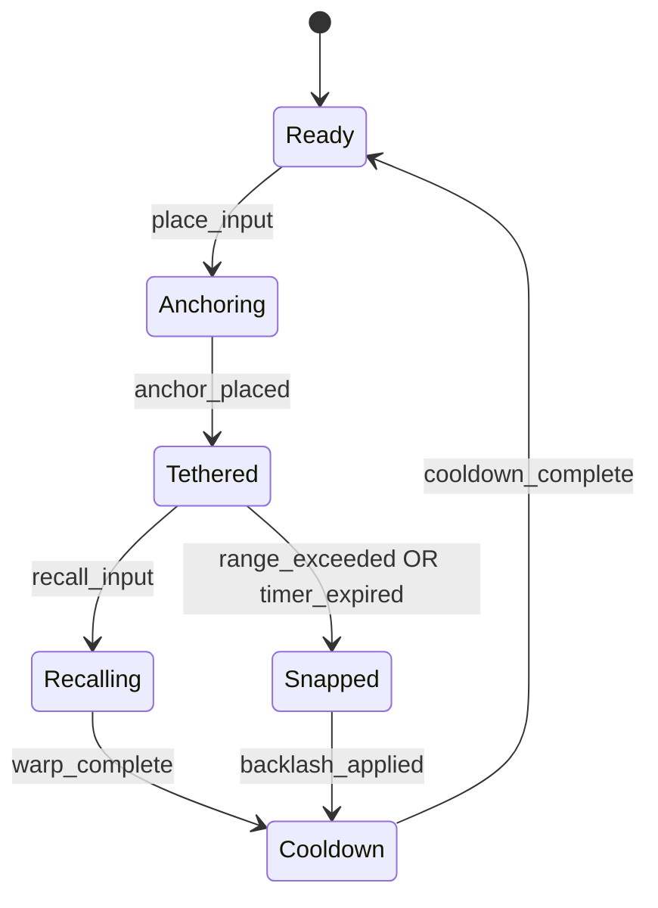

# Void Tether — Mechanic Specification

## Player Fantasy
You are a Voyager who has learned to harness the unstable energy between dimensions. By anchoring a tether of void energy to a point in space, you create a lifeline that lets you warp back instantly — but the tether degrades, and if you push it too far, the void pulls back.

## Overview
Void Tether is an active traversal-combat hybrid ability. The player places a spatial anchor at their current location, then continues exploring or fighting. At any time within the tether's duration, the player can activate a recall to warp back to the anchor point, dealing AoE void damage at both the departure and arrival locations. The tether has a maximum range and duration, and snapping it (by exceeding range or timer) causes a backlash that damages the player.

## Core Loop
1. Player places anchor (cast time: 0.3s)
2. Player moves freely, fights, explores
3. Tether visually stretches and changes color as limits approach
4. Player decides: recall (safe return + AoE damage) or let it snap (backlash)
5. After recall or snap, cooldown begins
6. Loop back to step 1

## Parameters
| Parameter | Type | Default | Range | Description |
|-----------|------|---------|-------|-------------|
| anchor_cast_time | float | 0.3 | 0.1-0.5 | Time to place the anchor |
| max_tether_duration | float | 12.0 | 8-20 | Seconds before tether auto-snaps |
| max_tether_range | float | 40.0 | 25-60 | Maximum distance in meters before snap |
| recall_warp_time | float | 0.15 | 0.05-0.3 | Time for warp animation |
| aoe_damage_base | float | 35.0 | 20-60 | Base void damage at departure and arrival |
| aoe_radius | float | 5.0 | 3-8 | Radius of AoE damage zones |
| snap_backlash_pct | float | 0.15 | 0.05-0.25 | Percent of max HP lost on snap |
| cooldown | float | 18.0 | 12-30 | Cooldown after recall or snap |
| tether_warning_pct | float | 0.75 | 0.6-0.9 | Percent of range/duration before warning VFX |
| void_resonance_stacks | int | 0 | 0-5 | Stacks gained from successful recalls, buffing next tether |

## Formulas
```python
# AoE damage at departure and arrival
effective_aoe = aoe_damage_base * (1 + void_attunement_modifier) * (1 + resonance_stacks * 0.08)

# Snap backlash damage
snap_damage = player_max_hp * snap_backlash_pct * (1 - void_resistance)

# Tether decay rate (visual feedback)
decay_pct = max(elapsed_time / max_tether_duration, current_distance / max_tether_range)

# Cooldown reduction from resonance stacks
effective_cooldown = cooldown * (1 - resonance_stacks * 0.05)
```

## State Machine


## System Interactions
- **Combat:** AoE damage at both ends creates tactical repositioning during fights; snap backlash adds risk-reward tension
- **Movement/Traversal:** Creates a "save point" for risky platforming or exploration of hazardous zones
- **Progression:** Void Resonance stacks reward mastery; Void Attunement skill tree enhances tether parameters
- **Economy:** Tether Stabilizer consumable extends duration by 50% (crafted from Void Shards)
- **Narrative:** Ties into the Void Rift storyline; using tether near Rift anomalies triggers lore fragments

## Edge Cases
- Player places anchor, then enters a cutscene or dialogue — tether pauses during non-gameplay states
- Player places anchor on a moving platform — anchor is world-space, not object-space; warn if platform moves away
- Two players place anchors at same location — AoE stacks but does not double-dip on status effects
- Player is crowd-controlled during recall — recall is interrupted, tether remains active
- Player falls off map while tethered — auto-recall triggers as a safety net

## Exploit Potential
- **Infinite safe exploration:** Place anchor in safe zone, explore dangerous area, recall to safety → Mitigate with max range limit and snap backlash
- **AoE farming:** Place anchor in mob cluster, run to second cluster, recall for double AoE → Acceptable; this is skilled play. Cap resonance stacks to prevent scaling abuse
- **PvP escape tool:** Tether + recall makes player uncatchable → Mitigate with visible tether line that enemies can follow; add 0.5s vulnerability window after recall

## Balance Notes
- `aoe_damage_base`: Needs tuning relative to other AoE abilities; should not outperform dedicated AoE skills at base
- `snap_backlash_pct`: Must hurt enough to discourage careless use but not one-shot; 15% HP feels right at mid-game
- `cooldown`: 18s is long; test whether rotation feels good with other abilities
- `void_resonance_stacks`: Cap at 5 to prevent runaway scaling; each stack should feel meaningful but not mandatory
