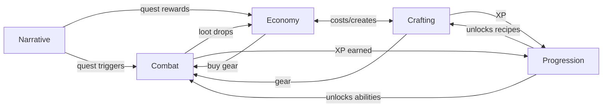

# System Interaction Matrix

A template and guide for analyzing how game systems interact with each other in
Infinite Voyage. Use this to detect hidden dependencies, emergent behaviors, and
potential exploit chains.

---

## What Is an Interaction Matrix?

An interaction matrix maps every game system against every other system, documenting
how they affect each other. This prevents "orphan systems" (systems that don't
connect to anything) and reveals unintended interactions.

---

## Matrix Template

Fill in each cell with the interaction type:

| | Combat | Movement | Economy | Crafting | Progression | Narrative | Social |
|---|--------|----------|---------|----------|-------------|-----------|--------|
| **Combat** | — | [fill] | [fill] | [fill] | [fill] | [fill] | [fill] |
| **Movement** | [fill] | — | [fill] | [fill] | [fill] | [fill] | [fill] |
| **Economy** | [fill] | [fill] | — | [fill] | [fill] | [fill] | [fill] |
| **Crafting** | [fill] | [fill] | [fill] | — | [fill] | [fill] | [fill] |
| **Progression** | [fill] | [fill] | [fill] | [fill] | — | [fill] | [fill] |
| **Narrative** | [fill] | [fill] | [fill] | [fill] | [fill] | — | [fill] |
| **Social** | [fill] | [fill] | [fill] | [fill] | [fill] | [fill] | — |

### Interaction Types

| Symbol | Type | Description |
|--------|------|-------------|
| **→** | Feeds into | System A produces outputs consumed by System B |
| **←** | Depends on | System A requires inputs from System B |
| **↔** | Bidirectional | Both systems affect each other |
| **⊘** | No interaction | Systems are independent (verify this is intentional) |
| **⚡** | Emergent | Interaction creates behavior neither system intended alone |
| **⚠** | Conflict | Systems can contradict or undermine each other |

---

## How to Build the Matrix

### Step 1: List All Systems

Enumerate every discrete game system. A "system" is any set of rules that governs
a type of player interaction:

```
Examples for Infinite Voyage:
- Combat (melee, ranged, abilities, status effects)
- Movement (walking, sprinting, climbing, fast travel)
- Economy (currencies, vendors, trading, crafting costs)
- Crafting (gathering, recipes, upgrading)
- Progression (XP, leveling, skill trees, unlocks)
- Narrative (quests, dialogue, lore discovery)
- Social (guilds, chat, co-op, PvP matchmaking)
- Meta-systems (achievements, daily challenges, seasonal events)
```

### Step 2: For Each Pair, Ask

1. **Does System A produce anything System B consumes?** (→ feeds into)
2. **Does System B produce anything System A consumes?** (← depends on)
3. **Can both systems be active simultaneously?** (look for conflicts)
4. **Does combining both systems create emergent behavior?** (⚡)
5. **If System A is removed, does System B still work?** (dependency check)

### Step 3: Rate Interaction Strength

| Strength | Description |
|----------|-------------|
| **Strong** | Core dependency — removing the interaction breaks both systems |
| **Medium** | Enhances experience but both systems work independently |
| **Weak** | Minor flavor connection, purely cosmetic or informational |

---

## Example: Filled Matrix

| | Combat | Economy | Crafting | Progression |
|---|--------|---------|----------|-------------|
| **Combat** | — | →Loot drops feed economy | ←Crafted gear used in combat | →XP earned from kills |
| **Economy** | ←Loot from combat | — | ↔Crafting costs currency, creates value | →Can buy XP boosts |
| **Crafting** | →Produces combat gear | ↔Uses/creates economic value | — | →Crafting grants XP |
| **Progression** | →Unlocks abilities | ←Level gates content | ←Unlocks recipes | — |

---

## Analyzing the Matrix

### Red Flags

| Pattern | Problem | Example |
|---------|---------|---------|
| **Row of ⊘** | Orphan system — disconnected from everything | Social system with no gameplay impact |
| **All →, no ←** | One-way dependency — system only gives, never receives | Economy only receives, never costs anything |
| **⚠ cells** | Direct conflicts between systems | PvP rewards undermine PvE economy |
| **Too many ⚡** | Emergent complexity — hard to predict outcomes | 5+ emergent interactions = balance nightmare |
| **Circular →** | Feedback loop — can amplify or spiral | Combat → loot → crafting → better combat → more loot |

### Health Checks

```
[ ] Every system has at least 2 connections (no orphans)
[ ] No system has only outgoing connections (unidirectional)
[ ] All ⚠ conflicts are acknowledged with mitigation plans
[ ] Circular dependencies are identified and checked for snowball potential
[ ] Emergent interactions are tested in simulation
[ ] Removing any single system doesn't break more than 2 others
```

---

## Interaction Documentation Format

For each non-trivial interaction, document:

```markdown
### [System A] → [System B]: [Interaction Name]

**Type**: Feeds into / Depends on / Bidirectional / Emergent / Conflict
**Strength**: Strong / Medium / Weak

**Description**: [What happens when these systems interact]

**Data flow**: [What specific data/resources pass between them]
  - [System A] provides: [what]
  - [System B] consumes: [what]

**Balance implications**:
  - [How does tuning System A affect System B?]
  - [What parameter controls this interaction?]

**Edge cases**:
  - [What happens at extreme values?]
  - [Can this interaction be exploited?]
```

---

## Mermaid Diagram Template

Visualize the interaction graph:



### Reading the Diagram

- Arrows show data/resource flow direction
- Bidirectional arrows indicate mutual dependency
- Nodes with many incoming arrows are "sink" systems (depend on many inputs)
- Nodes with many outgoing arrows are "source" systems (feed many outputs)
- Isolated nodes are orphan systems (design smell)

---

## Updating the Matrix

Review and update the interaction matrix:
- After adding a new game system
- After a major balance change
- After discovering an unintended interaction in playtesting
- During each GDD consistency review (see consistency.md)
