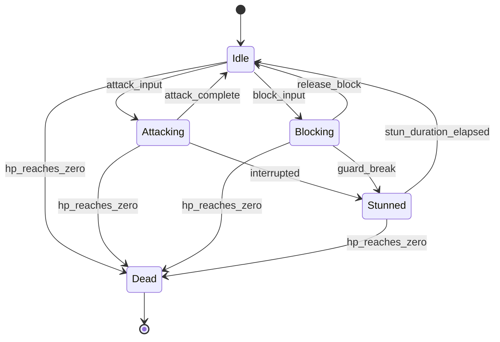

# State Machine Guide

How to specify state-based game mechanics for game development. State machines
are the standard way to document any system where an entity transitions between
distinct states based on events or conditions.

---

## When to Use a State Machine

Use a state machine whenever a game entity can be in one of several distinct
modes, and transitions between modes are triggered by specific events:

| Use Case | Example States |
|----------|---------------|
| Character combat | Idle, Attacking, Blocking, Dodging, Stunned, Dead |
| NPC AI behavior | Patrol, Alert, Chase, Attack, Flee, Return |
| Quest progression | Available, Active, Completed, Failed, Turned In |
| Item states | Normal, Equipped, Broken, Enchanted |
| UI screens | Loading, Main Menu, In-Game, Paused, Game Over |
| Status effects | None, Poisoned, Burning, Frozen, Stunned |
| Game phases | Lobby, Countdown, Playing, Overtime, Post-Match |

---

## State Machine Specification Format

### Text Format

```markdown
## State Machine: [Entity Name]

### States
| State | Description | Entry Condition | Exit Conditions |
|-------|-------------|-----------------|-----------------|
| [name] | [what this state means] | [how to enter] | [how to leave] |

### Transitions
| From | To | Trigger | Guard Condition | Actions |
|------|----|---------|-----------------|---------|
| [state] | [state] | [event] | [condition that must be true] | [what happens during transition] |

### Initial State: [state name]
### Terminal States: [state names, if any]
```

### Mermaid Diagram Format



---

## State Machine Components

### States

A state represents a distinct mode of behavior. Each state should define:

| Property | Description | Example |
|----------|-------------|---------|
| **Name** | Unique identifier | `Attacking` |
| **Description** | What the entity does in this state | "Playing attack animation, dealing damage" |
| **Duration** | Fixed, variable, or indefinite | "0.8 seconds (animation length)" |
| **Allowed actions** | What the entity can do while in this state | "Cannot move, can cancel into dodge" |
| **Visual indicator** | How the player knows this state is active | "Red glow on weapon, attack animation" |
| **On-enter effects** | What happens immediately when entering | "Start attack animation, apply hit detection" |
| **On-exit effects** | What happens when leaving this state | "Clear hit detection, reset combo counter" |
| **Tick effects** | What happens each frame/tick while in state | "Drain stamina at 5/sec" |

### Transitions

A transition is a change from one state to another. Each transition should define:

| Property | Description | Example |
|----------|-------------|---------|
| **Source state** | Where the transition starts | `Idle` |
| **Target state** | Where the transition goes | `Attacking` |
| **Trigger** | Event that initiates the transition | `attack_button_pressed` |
| **Guard condition** | Boolean check that must be true | `stamina > 10 AND not_on_cooldown` |
| **Priority** | When multiple transitions are valid | `dodge (priority 1) > attack (priority 2)` |
| **Actions** | Side effects during the transition | `consume 10 stamina, start animation` |

### Guard Conditions

Guards prevent transitions when conditions aren't met:

```python
# Example guard conditions
def can_attack(entity):
    return (
        entity.stamina >= ATTACK_STAMINA_COST
        and entity.attack_cooldown <= 0
        and not entity.is_stunned
    )

def can_dodge(entity):
    return (
        entity.stamina >= DODGE_STAMINA_COST
        and entity.dodge_cooldown <= 0
        and entity.current_state != 'stunned'
    )
```

---

## Common State Machine Patterns

### 1. Interruptible Actions

Some states can be cancelled by higher-priority actions:

```
State: Attacking
  Can be interrupted by: Dodge (priority 1), Hit Reaction (forced)
  Cannot be interrupted by: Another Attack, Block

Transition priority order:
  1. Hit Reaction (forced, always applies)
  2. Dodge (if stamina available)
  3. Block (only during recovery frames)
  4. Attack (only after recovery frames)
```

### 2. Buffered Input

Accept input during a state but execute it when the state completes:

```
State: Attacking
  Input buffer: stores next action (attack, dodge, block)
  On attack_complete:
    If buffer has input → transition to buffered state
    Else → transition to Idle
```

### 3. Hierarchical States (Substates)

Group related states under a parent:

```
Combat (parent state)
  ├── Idle
  ├── Attacking
  │   ├── Light Attack
  │   ├── Heavy Attack
  │   └── Combo Finisher
  ├── Blocking
  │   ├── Active Block
  │   └── Perfect Parry
  └── Dodging
      ├── Dodge Roll
      └── Backstep

Movement (parent state)
  ├── Walking
  ├── Running
  └── Climbing
```

Transitions within a parent group are handled internally. Transitions between
parent groups require explicit rules.

### 4. Cooldown States

States that prevent re-entry for a duration:

```
Dodge → 0.3s iframes → 0.5s recovery → 1.0s cooldown before next dodge
  [Dodging] → [Recovering] → [Idle + dodge_cooldown timer running]
```

### 5. Status Effect States

Overlapping states applied by external sources:

```
Base State: Idle (movement + actions)
Overlay States (can stack):
  - Poisoned: -5 HP/sec for 10 seconds
  - Slowed: movement speed -30% for 5 seconds
  - Burning: -10 HP/sec for 3 seconds, spread on contact

Resolution rules:
  - Same type: Refresh duration (don't stack damage)
  - Different types: All apply simultaneously
  - Immune states: Frozen prevents Burning, Stunned prevents actions
```

---

## Design Checklist for State Machines

```
[ ] Every state has at least one entry transition and one exit transition
[ ] No dead-end states (states with no exit) unless they're terminal (Dead, Complete)
[ ] Initial state is defined
[ ] All transitions have explicit triggers (no ambiguous state changes)
[ ] Guard conditions prevent invalid transitions
[ ] Priority is defined when multiple transitions compete
[ ] Duration is specified for timed states
[ ] Visual/audio feedback exists for every state
[ ] Edge cases are addressed:
    [ ] What happens if the trigger fires while already in the target state?
    [ ] What happens if two triggers fire simultaneously?
    [ ] What happens if a guard condition changes mid-transition?
[ ] State machine is documented in both text table AND mermaid diagram
```

---

## Anti-Patterns

| Anti-Pattern | Problem | Fix |
|-------------|---------|-----|
| **State explosion** | Too many states (30+) making behavior unpredictable | Use hierarchical states, merge similar states |
| **Hidden transitions** | Transitions not documented but exist in code | Audit all state changes, document every one |
| **Missing guards** | Player can enter invalid states (attacking while dead) | Add guard conditions to every transition |
| **No feedback** | Player can't tell what state they're in | Add visual/audio indicators for every state |
| **Infinite loops** | Two states transition to each other every frame | Add cooldowns or one-frame-minimum durations |
| **God state** | One state that can transition to every other state | Limit transitions, use hierarchical grouping |

---

## Implementation Notes

When handing a state machine spec to engineers:

1. Provide the mermaid diagram for visual overview
2. Provide the transition table for exact implementation
3. Specify the update rate (per-frame, per-tick, event-driven)
4. Note any performance considerations (AI state machines for 100+ entities)
5. Define serialization needs (does state persist across save/load?)
